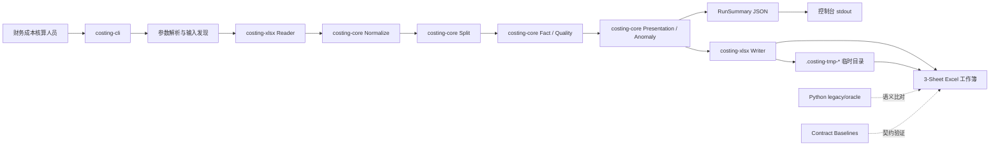
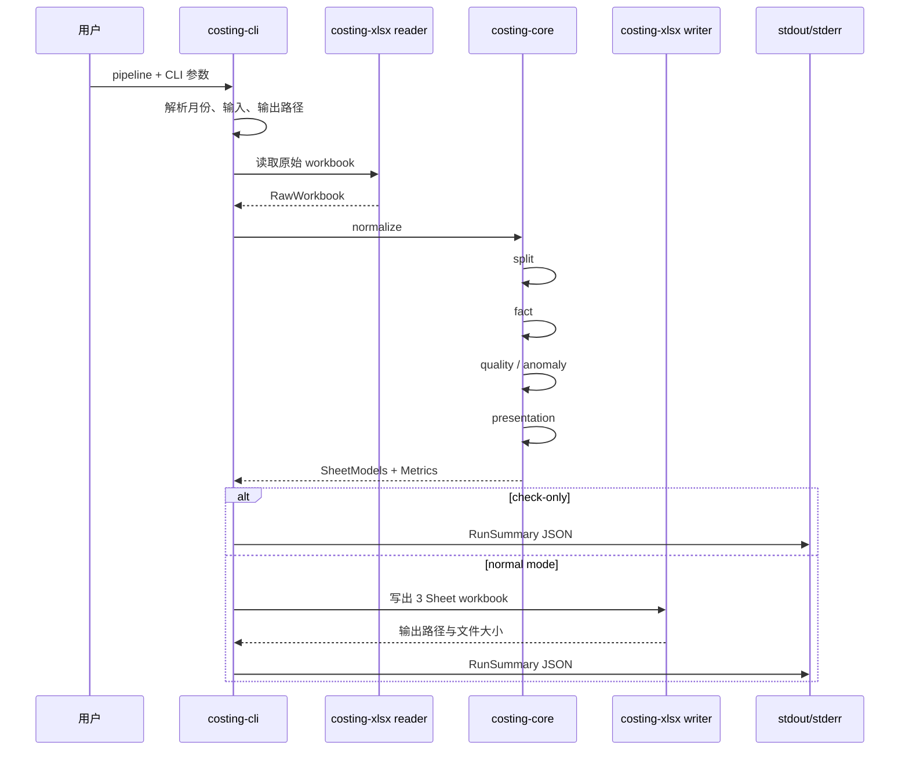
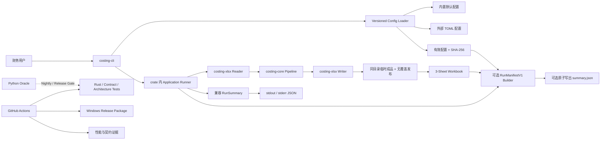
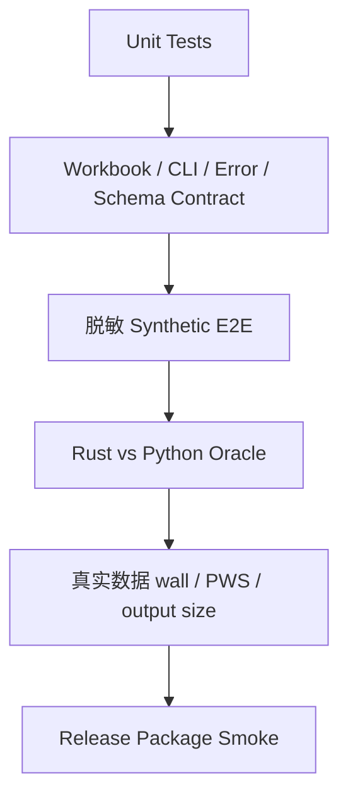
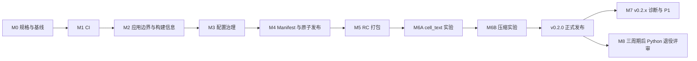

# Costing Calculate 生产化与性能优化 PRD

## 1. 文档信息

| 项目       | 内容                                                        |
| ---------- | ----------------------------------------------------------- |
| 产品名称   | Costing Calculate / 成本计算 ETL 工具                       |
| PRD 主题   | Rust 主路径生产化、可审计性、配置治理与低风险性能优化        |
| 目标版本   | `v0.2.0`                                                    |
| 文档状态   | Review Ready（实施方案已对齐，待业务、测试和运维联合评审）   |
| 评审对象   | 产品负责人、财务成本核算人员、Rust/Python 开发人员、测试及运维人员 |
| 仓库       | `Aspirin86942/02--costing_calculate`                        |
| 现状评估日期 | 2026-07-25                                                |
| 评估分支   | `main`                                                      |
| 基线提交   | `5cda03b6d35f351115d6cb8d08ee2e66f1ba9904`                  |
| 目标运行形态 | 本地离线 CLI 批处理工具，优先支持 Windows x86_64          |
| 后续稳定版本 | Python 主运行路径经独立审批退役后发布 `v1.0.0`            |

### 1.1 权威顺序与术语

* 在目标功能尚未实现前，当前代码、自动化测试、`AGENTS.md` 和冻结 baseline 是现状行为的权威来源；本 PRD 描述 `v0.2.0` 的目标状态，不得把未来能力写成已经上线。
* 功能合入后，以代码、schema、contract tests 和 Release 证据共同证明 PRD 已实现；只有文档勾选不构成完成。
* `RunSummary`：当前 stdout 成功 JSON 的兼容模型。
* `RunManifestV1`：仅在显式 `--summary-output` 时持久化的版本化审计模型。
* `FileConfigV1`：内置或外部 TOML 的完整配置模型。
* `PipelineRules`：完成严格校验后交给 `costing-core` 的 owned 领域规则。
* `EffectiveConfigView`：包含 external 与 sealed 字段及来源、用于展示和语义哈希的确定性视图。

---

## 2. 执行摘要

Costing Calculate 当前已经完成从 Python 主实现向 Rust 主实现的迁移。Rust CLI 是 GB、SK 两条成本核算管线的默认入口，Python 代码主要保留为 legacy、oracle 和 regression 基线。系统当前默认生成 3 张业务工作表，并已经具备月份过滤、预检、性能采样、质量指标、结构化错误以及大工作簿低内存写出能力。 ([GitHub][1])

从代码组织看，项目属于一个边界较清晰的**模块化单体、本地批处理 ETL 系统**：

* `costing-cli` 负责命令行接口和运行编排；
* `costing-core` 负责标准化、拆分、事实表构建、质量检查、异常分析和展示模型；
* `costing-xlsx` 负责 Excel 读写；
* `costing-oracle-tests` 和 Python 测试体系负责跨实现契约验证。 ([GitHub][1])

当前架构的主要问题已经不再是“Rust 是否能够替代 Python”，而是：

1. **工程交付能力不足**：GitHub Actions 页面尚呈现初始化引导，仓库也没有正式 Release，构建、测试、打包和分发仍缺少自动化闭环。 ([GitHub][2])
2. **运行审计信息没有形成持久化产物**：控制台已经输出兼容性敏感的 `RunSummary`，但尚无版本化、可选持久化的 `RunManifestV1`，不利于财务追溯、问题定位和批次对比。 ([GitHub][3])
3. **可维护配置与冻结契约尚未分层**：GB/SK 产品顺序等规则仍以 Rust 静态数组方式定义；与此同时，独立成本项、异常阈值、Workbook 结构等规则不能被普通配置任意改变，必须建立明确的配置权限边界。 ([GitHub][4])
4. **性能已达标，但 SK 时间余量较窄**：2026-07-12 的同机 N=5 验收中，SK 全量运行中位数为 `19.883s`，距离 `20.0s` 的本机验收线只有 `0.117s`；PWS 中位数约 `1.361 GiB`，仍在 `2 GiB` 上限内。该数据是单机验证快照，并非跨设备 SLA；`v0.2.0` 的性能工作以完成受控实验和守住现有门禁为硬要求，以相对基线改善 `5%` 为挑战目标。 ([GitHub][5])
5. **双语言维护成本仍然存在**：Rust 已成为主路径，但 Python 实现、Python 测试和跨语言 oracle 尚未进入正式退役阶段。 ([GitHub][6])

> **产品决策建议：**
>
> `v0.2.0` 不应继续扩展 GUI、Web 服务或新的报表维度，而应优先完成“可构建、可发布、可追溯、可配置、可验证”的生产化闭环，并在不改变 Excel 契约的前提下实施低风险性能优化。

---

## 3. 产品背景

### 3.1 业务场景

该项目用于处理金蝶 ERP 导出的成本计算单 Excel 文件，完成以下工作：

1. 识别并读取 GB 或 SK 成本管线对应的原始工作簿。
2. 去除无效表头、扁平化多层表头、标准化字段。
3. 补齐月份、产品、工单、供应商、成本项目等维度。
4. 将明细行和数量聚合行拆分。
5. 构建成本事实数据。
6. 计算直接材料、直接人工、制造费用、委外加工费及 SK 软件费用等成本指标。
7. 进行总成本勾稽、数据质量检查和单位成本异常分析。
8. 生成财务核算和异常排查所需的 Excel 工作簿。

当前 Rust 输出契约固定为：

* `成本计算单总表`
* `成本计算单数量聚合维度`
* `成本分析工单维度`

`成本分析产品维度` 不属于 Rust 新系统输出契约。 ([GitHub][1])

### 3.2 当前典型使用方式

```bash
# 自动发现 GB 输入
costing-calculate gb

# 自动发现 SK 输入
costing-calculate sk

# 显式指定输入和输出
costing-calculate gb \
  --input data/raw/gb/gb-2026-06.xlsx \
  --output data/processed/gb/gb-2026-06_处理后.xlsx

# 月份过滤
costing-calculate sk \
  --month-start 2026-01 \
  --month-end 2026-06

# 只做预检，不生成 workbook
costing-calculate sk --check-only

# 输出阶段耗时
costing-calculate sk --check-only --benchmark
```

当前省略 `--input` 时，程序扫描 `data/raw/<pipeline>/<pipeline>-*.xlsx`：匹配 1 个文件时自动使用，0 个文件时报 `FILE_NOT_FOUND`，多个文件时报 `INVALID_INPUT`。CLI 还支持显式输入、输出和月份范围参数。 ([GitHub][1])

---

## 4. 当前架构分析

### 4.1 架构类型

当前架构可以定义为：

> **模块化单体 + 命令行驱动 + 本地离线处理 + 契约优先的双实现迁移架构**

它不是微服务，也不是长期运行的后台服务。一次 CLI 调用代表一次独立的成本计算任务，输入和输出均为本地 Excel 文件。

### 4.2 AS-IS 架构图



### 4.3 Rust Workspace 模块职责

当前 Cargo workspace 包含 4 个 crate，并锁定了 `calamine`、`rust_decimal`、`serde`、`tempfile` 以及受控 `rust_xlsxwriter` fork 等依赖。 ([GitHub][7])

| 模块                     | 当前职责                                       | 架构评价                                   |
| ---------------------- | ------------------------------------------ | -------------------------------------- |
| `costing-cli`          | CLI 参数解析、输入输出路径解析、任务编排、成功/失败 JSON 输出       | `run.rs::run` 当前直接编排读入、领域处理、写出和摘要；引入配置与 Manifest 前应先形成 crate 内应用层 |
| `costing-core`         | 数据模型、标准化、拆分、事实构建、质量检查、异常评分、展示模型、Sheet 契约   | 领域核心边界清晰，是当前架构最稳定的部分                   |
| `costing-xlsx`         | Excel reader、snapshot、writer、low-memory 写出 | 基础设施适配器边界合理，但 reader/writer 是主要性能和内存热点 |
| `costing-oracle-tests` | Rust 与 oracle 的运行时和工作簿契约支持                 | 迁移阶段价值较高，正式退役 Python 后应精简              |
| Python `src/`          | 原 Python ETL、分析、Excel 输出和 service          | 当前作为 legacy/oracle 保留，不应继续承载新生产功能      |
| `tests/contracts`      | Workbook、CLI、error-log 契约 baseline         | 契约治理较成熟，应继续作为变更门禁                      |
| `tests/architecture`   | Python 导入规则等架构约束                           | 当前覆盖有限，后续应补充 Rust crate 依赖约束           |

`costing-core` 已按照 `normalize`、`split`、`fact`、`quality`、`scoring`、`anomaly`、`presentation`、`sheet_contract` 等领域能力拆分；`costing-xlsx` 则将 reader、snapshot 和 writer 分离。 ([GitHub][8])

### 4.4 当前运行链路



现有性能文档将 SK 路径拆分为 `ingest → normalize → split → fact → presentation → export`。暖跑基线中，分析链约 `8.2s`，导出约 `11.7s`；主要耗时集中在 ingest 和 export。 ([GitHub][9])

### 4.5 当前输出及安全行为

现有系统已经具备以下正确行为：

* 拒绝覆盖已有输出文件；
* 禁止输入路径和输出路径相同；
* `--check-only` 不生成 workbook；
* 单 Sheet 达到 `5,000,000` 个行列 slots 时启用 low-memory writer；
* 临时目录位于目标输出目录附近；
* 成功和失败路径均主动清理临时目录；
* 输出工作簿的 Sheet 顺序、列顺序、冻结窗格、筛选、数字格式和高亮位置由 contract baseline 冻结。 ([GitHub][1])

当前 writer 使用 `create_new` 直接创建最终输出路径，并在可处理失败时删除该文件；这能阻止覆盖并处理普通错误，但不等同于进程崩溃、断电场景下的原子发布。`v0.2.0` 必须改为“同目录临时成品 → flush/sync → 无覆盖发布”，确保最终路径只出现完整工作簿。

### 4.6 当前结构化输出

CLI 成功时向 stdout 输出格式化 JSON，失败时向 stderr 输出结构化错误 JSON，并使用非零退出状态。当前成功摘要已包含：

* `status`
* `request_id`
* `pipeline`
* `output_written`
* `output_size_bytes`
* `workbook_path`
* `sheet_count`
* `error_log_count`
* `issue_type_counts`
* `quality_metrics`
* `run_counts`
* `stage_timings`

这说明可观测性的基础模型已经存在，缺失的主要是**独立的持久化、版本化和可追溯模型**。现有控制台 `RunSummary` 是兼容性契约，不能为了审计字段直接扩张或改名；新增 sidecar 使用独立的 `RunManifestV1`。 ([GitHub][3])

---

## 5. 当前架构评价

以下评分是基于仓库现状的产品与架构综合判断，满分为 5 分。

| 维度        |  评分 | 说明                                                                        |
| --------- | --: | ------------------------------------------------------------------------- |
| 业务正确性     | 4.5 | 已有 workbook、runtime、quality、error-log 和 CLI 契约；Rust/Python oracle 验证结果较完整 |
| 领域模块边界    | 4.0 | CLI、core、xlsx、oracle 的职责总体清晰                                              |
| 性能        | 4.0 | 已通过现有本机验收，但 SK wall time 余量偏小                                             |
| 内存控制      | 4.0 | 已有自适应 low-memory writer 和临时目录清理                                           |
| 可观测性      | 3.0 | 已有结构化摘要和阶段耗时，但未形成持久化审计产物                                                  |
| 配置治理      | 2.0 | 多项业务配置仍硬编码，缺少 schema、配置版本和摘要指纹                                            |
| CI/CD 与发布 | 1.5 | 尚未形成公开可见的自动化 workflow 和 Release 分发                                        |
| 可维护性      | 3.0 | Rust 主路径较清晰，但 Python/Rust 双栈仍带来较高维护成本                                     |
| 可扩展性      | 3.0 | 适合继续扩展 GB/SK 规则，但直接增加新入口或服务形态会放大 CLI 编排负担                                 |
| 审计与合规     | 2.5 | 有 request ID 和质量指标，但不能仅依靠控制台日志还原一次历史运行                                    |

### 5.1 当前优势

1. **Rust 主路径已经通过实测验证。**
   2026-07-12 的验证快照记录了 168 个 Rust workspace 测试、7 个 Python contracts、39 个 workbook comparator 测试等门禁，并记录了 GB/SK oracle 零不一致。 ([GitHub][5])

2. **契约治理强于一般 ETL 脚本。**
   Workbook、CLI 和 error-log 都有 baseline，且明确规定“纯重构不得修改 baseline，只有业务口径变化时才允许更新”。 ([GitHub][10])

3. **大文件写出策略已经工程化。**
   项目不是简单地把全部工作簿留在内存中，而是根据 Sheet 规模切换 low-memory writer，并对临时目录进行成功和失败清理。 ([GitHub][1])

4. **结构化错误和运行摘要已经具备。**
   后续建立审计 manifest 不需要重新设计一套运行模型，只需扩展并持久化现有 `RunSummary`。

### 5.2 主要技术债务

#### 5.2.1 发布依赖开发环境

用户当前通常需要：

* 安装 Rust toolchain；
* 获取仓库；
* 使用 Cargo 编译；
* 在正确目录下运行。

对于财务使用者而言，合理的交付方式应是经过验证和签名或校验的独立可执行包，而不是源代码构建。

#### 5.2.2 配置硬编码

`PipelineConfig` 当前直接持有静态的 `product_order` 和 `standalone_cost_items`，GB/SK 具体规则定义在 Rust 源码中。业务顺序或成本项目发生变化时，需要经过代码修改、编译、测试和发布全过程。 ([GitHub][4])

#### 5.2.3 审计链不完整

控制台摘要可以回答“这次跑了多久、产生了几个问题”，但目前难以稳定回答：

* 使用的是哪个程序版本？
* 对应哪个 Git commit？
* 输入文件是否与上次完全一致？
* 使用了哪个配置版本？
* 输出文件是否被后续修改？
* 哪次运行生成了当前 workbook？
* 运行时是否启用了 low-memory？
* 实际读取的是哪个 Sheet？
* 输入和输出各自的 SHA-256 是什么？

#### 5.2.4 性能基线余量较小

当前 SK 验收中位数为 `19.883s`，而本机验收线为 `20.0s`。虽然测试已经通过，但磁盘缓存、杀毒软件、并发负载和硬件差异均可能造成较大波动。仓库性能文档也明确指出 ingest 冷热差距明显，因此该结果不能当成跨设备 SLA。 ([GitHub][11])

#### 5.2.5 双语言真值来源尚未完全收敛

迁移阶段保留 Python oracle 是合理的，但若长期不设置退役门槛，将产生：

* 同一业务规则需要在两种语言中理解；
* 依赖和安全更新需要同时维护；
* 测试时间增加；
* 开发者难以判断 Python 还是 Rust 才是业务真值；
* 已经退出产品契约的产品维度代码仍可能造成认知干扰。

---

## 6. 产品目标

### 6.1 核心目标

#### G1. 建立可重复的构建与发布流程

每次合并和发布均能自动执行格式、单元测试、契约测试、打包和基础运行验证，形成可下载的 Windows 可执行包。

#### G2. 建立完整运行审计链

每次运行均有唯一 `request_id`。默认控制台 `RunSummary` 保持兼容；用户显式指定 `--summary-output` 时，程序额外写出版本化 `RunManifestV1`，关联程序版本、输入文件、有效配置、输出文件、质量指标和阶段耗时。

#### G3. 建立版本化配置治理

将产品白名单、显示顺序和安全输入模式迁移到具有 schema、版本号、严格校验、语义指纹和内置默认值的配置体系。独立成本项集合、异常算法阈值、Decimal 语义、Workbook 契约和 writer 工程参数在 `v0.2.0` 继续冻结，普通外部配置不得覆盖。

#### G4. 在不改变业务契约的前提下降低 SK 执行时间

优先完成当前代码仍未实施的低风险优化实验：

* `cell_text` 借用化；
* ZIP 压缩级别 A/B 测试；
* 后续再评估 float-to-Decimal 精确整数快路径和 Thin LTO。

P0 硬门槛是实验可复现、契约零差异、输出大小和 PWS 不越线；只有达到各自采用门槛的候选才合入。SK wall 相对基线改善 `5%` 是挑战目标，不以放宽正确性或文件大小门禁换取。

#### G5. 保持输出完全兼容

默认运行行为继续满足：

* 3 张 Sheet；
* Sheet 顺序和字段契约不变；
* 默认不覆盖文件；
* 默认不产生额外 sidecar 文件；
* `--check-only` 默认不写 workbook；
* 默认 stdout/stderr JSON 的字段、流向和退出码不变；
* Decimal 和 Excel 数值语义不变。

#### G6. 为 Python 分阶段退役建立明确门槛

Python 不再承载新功能，只用于契约和回归验证；完成规定的稳定运行周期后，分阶段删除生产路径和冗余测试设施。

---

### 6.2 非目标

本 PRD 不包含以下内容：

1. 不开发 GUI。
2. 不开发 Web 管理后台。
3. 不将工具改造成常驻服务或微服务。
4. 不恢复 `成本分析产品维度`。
5. 不在 `v0.2.0` 增加目录批处理或多文件并行处理。
6. 不替换 Calamine 或自行开发流式 XLSX XML 解析器。
7. 不将 Decimal 计算改为全链路 f64。
8. 不改变默认工作簿样式和列契约。
9. 不在没有独立审批的情况下直接删除 Python oracle。
10. 不以多线程作为当前性能优化主方向。

仓库已有优化评估认为，多线程对当前串行 ingest/export 链路收益有限，却会显著增加 writer、格式共享和临时文件管理复杂度；自行替换 Calamine 的成本也远高于当前收益。 ([GitHub][9])

---

## 7. 用户角色与用户故事

### 7.1 财务成本核算人员

#### US-01 正常生成成本工作簿

> 作为财务成本核算人员，我希望直接运行一个可执行文件并指定 GB 或 SK，从而不安装 Rust 或 Python 就能获得标准成本分析工作簿。

#### US-02 运行前预检

> 作为财务成本核算人员，我希望先执行预检，确认输入格式、月份范围、数据量和质量问题，再决定是否生成最终工作簿。

#### US-03 追溯历史运行

> 作为财务成本核算人员，我希望保留本次运行摘要，以便日后确认某个工作簿由哪个输入、哪个程序版本和哪个规则版本生成。

### 7.2 业务规则维护人员

#### US-04 调整产品顺序

> 作为业务规则维护人员，我希望通过受控配置调整产品显示顺序，而不是直接修改 Rust 源码。

#### US-05 配置变更校验

> 作为业务规则维护人员，我希望在真正处理 Excel 前验证配置是否完整、是否包含重复产品编码、是否引用未知成本项目。

### 7.3 开发及测试人员

#### US-06 自动回归

> 作为开发人员，我希望每个 Pull Request 自动执行 Rust 测试、Python contract、架构检查和格式检查，防止未验证代码进入主分支。

#### US-07 发布可执行包

> 作为维护人员，我希望创建版本标签后自动获得 Windows 可执行文件、校验和、版本信息和发布说明。

#### US-08 性能实验

> 作为性能优化人员，我希望对优化前后的二进制进行可重复 A/B 测试，并自动记录每阶段中位数、输出大小、哈希和结论。

### 7.4 审计或管理人员

#### US-09 证明结果可复现

> 作为审计人员，我希望通过运行 manifest 中的输入哈希、配置哈希、程序版本和输出哈希，验证某次成本计算结果的来源和完整性。

---

## 8. 目标架构

### 8.1 TO-BE 架构图



### 8.2 架构原则

#### P1. Contract First

业务输出契约优先级高于局部实现优化。任何性能、配置或架构重构都必须先证明：

* Workbook baseline 不变；
* runtime summary 兼容；
* error-log 语义不变；
* GB/SK oracle 无差异；
* 输出文件大小仍在限制内。

#### P2. Rust Production Only

新的生产功能只在 Rust 主路径实现。Python 仅允许：

* 维护 oracle；
* 修复 oracle 自身错误；
* 支持退役前必要的回归；
* 不允许新增独立业务功能。

#### P3. 默认行为保持兼容

所有新增能力采用显式参数开启，避免影响现有脚本：

* 不指定 `--config`：使用内置配置；
* 不指定 `--summary-output`：只输出现有控制台 `RunSummary`；
* 不指定新的日志参数：维持现有 JSON 字段、stdout/stderr 分流和退出码；
* writer 调优参数不作为 `v0.2.0` 普通外部配置暴露，使用代码中经过验收的默认值。

#### P4. 配置可变，但契约受控

不能把所有业务规则都无约束地暴露给用户。`v0.2.0` 按以下边界治理：

1. **外部可维护配置**：GB/SK 产品编码、产品名称、显示顺序和安全输入模式；
2. **可展示但不可覆盖的有效配置**：GB/SK 独立成本项集合及其固定顺序；
3. **冻结契约**：Sheet 名称和顺序、列定义和格式、Decimal 语义、异常算法及阈值、禁止覆盖策略；
4. **冻结工程参数**：low-memory slots 阈值、ZIP 压缩级别和临时目录策略。

外部文件必须完整声明 GB、SK 两条管线，采用替换语义而不是不透明深层合并。任何扩大独立成本项集合或修改冻结契约的需求，必须走 `contract-change`、业务审批、baseline diff 和新版本评审。

#### P5. Measure Before Adopt

性能优化必须以 A/B 数据决定是否采用，而不是仅根据代码直觉。建议继续使用仓库已定义的交错顺序、逐对反序、`N≥8` check-only 和 `N≥5` full-run 方法。 ([GitHub][9])

#### P6. Atomic Publish

工作簿和可选 Manifest 都必须在目标目录创建临时成品，完成 flush/sync 后再执行无覆盖发布。进程崩溃时允许遗留可诊断临时文件，但最终路径不得暴露半成品；`doctor` 只报告，不自动删除。

---

## 9. 产品范围与优先级

| 优先级 | Epic                 | 目标                             |
| --- | -------------------- | ------------------------------ |
| P0  | CI 与质量门禁             | 所有代码变更自动验证                     |
| P0  | 应用编排层整理              | 在新增配置和 Manifest 前建立稳定执行边界     |
| P0  | 运行 Manifest          | 形成可选的持久化运行审计记录                 |
| P0  | 配置治理                 | 引入版本化、严格校验的配置体系                |
| P0  | 原子落盘                 | 工作簿和 Manifest 的最终路径不暴露半成品      |
| P0  | Release 分发           | 先发布 RC，再在性能证据通过后发布正式版本       |
| P0  | `cell_text` 借用化      | 消除 normalize 热路径中的无效 String 分配 |
| P0  | ZIP 压缩级别实验           | 在文件大小门禁内降低 xlsx 保存耗时           |
| P1  | CLI 诊断能力             | 提供 `doctor`、human 日志和磁盘预检             |
| P1  | float-to-Decimal 快路径 | 降低 ingest CPU 和临时 String 成本    |
| P1  | Thin LTO + strip     | 评估正式发布构建优化                     |
| P1  | 私有真实数据定期回归           | 自动执行真实 GB/SK oracle 与性能门禁      |
| P2  | 字符串驻留                | 为更大规模输入降低 PWS                  |
| P2  | Python 分阶段退役         | 收敛到 Rust 单一生产实现                |
| P2  | 批量任务模式               | 在明确业务需求后支持多个工作簿串行处理            |

### 9.1 变更分级与审批

| 级别 | 典型变更 | 必须满足 |
| ---- | -------- | -------- |
| A：业务/契约重定义 | Sheet/列/格式、Decimal 语义、异常算法阈值、独立成本项集合、错误语义、不兼容 schema | `contract-change`、业务负责人批准、PRD 与 schema 更新、baseline diff、迁移/回滚方案 |
| B：受控产品能力 | 配置 schema、Manifest schema、新 CLI 参数、原子发布、应用层边界、生产依赖 | 设计评审、兼容测试、失败注入、Release notes；新增依赖另需用户批准 |
| C：内部优化/内容维护 | 不改变契约的性能优化、文档修订、外部产品白名单/顺序更新 | 一项假设一 PR 或一次受审配置变更、配置哈希/审计记录、不得更新 baseline |

任何代码变更如果同时触及多个级别，按最高级别治理；不能借性能或重构名义绕过 A/B 级审批。

### 9.2 设计验收

实施方案除自动测试外还必须通过以下人工检查：

* **可解释性**：财务使用者能从成功/失败输出判断是否生成了有效 workbook、下一步应做什么；
* **一致性**：默认命令、3-Sheet 输出、错误分流和禁止覆盖行为与当前版本一致；
* **可追溯性**：显式 Manifest 能唯一关联 source、输入、有效配置、输出和质量结果；
* **最小权限**：外部配置只能改变声明允许的业务维护面；
* **失败安全**：任何 writer/Manifest 失败都不会把半成品暴露为最终文件，也不会误删有效 workbook；
* **证据完整性**：每个里程碑的退出条件能由命令输出、schema、测试或哈希证明，而不是仅凭人工勾选。

---

## 10. 详细功能需求

### 10.1 Epic A：CI 与质量门禁

#### FR-A01 GitHub Actions CI

仓库必须增加 `.github/workflows/ci.yml`。

##### 触发条件

* Pull Request 创建或更新；
* 向 `main` 推送；
* 手动触发；
* Release workflow 调用。

##### 必须执行的任务

```bash
cargo fmt --manifest-path rust/Cargo.toml --all --check
cargo clippy --locked --manifest-path rust/Cargo.toml --workspace --all-targets --all-features -- -D warnings
cargo test --locked --manifest-path rust/Cargo.toml --workspace --all-features

uv sync --frozen --extra dev
uv run python -m ruff check src tests
uv run python -m ruff format src tests --check
uv run python -m pytest tests -q -m "not slow and not benchmark and not meta" --basetemp .pytest-tmp/ci
```

##### 平台要求

| 平台             | 用途                 | 优先级  |
| -------------- | ------------------ | ---- |
| Windows x86_64 | 主要生产平台、路径语义、可执行包验证 | 必须   |
| Ubuntu x86_64  | 快速测试、跨平台编译检查       | 建议   |
| macOS          | 非当前业务重点            | 暂不要求 |

##### 验收标准

* PR 必须通过 CI 才允许合并；
* Rust format、clippy、test 任一失败均阻止合并；
* Contract baseline 发生差异时必须失败；
* 第三方 Actions 使用完整 commit SHA 固定，Cargo 使用 `--locked`，uv 使用 lockfile 的 frozen 模式；
* CI 不读取或上传真实 ERP 工作簿；
* 缓存 Cargo 和 uv 依赖，但缓存失效不能影响正确性；
* CI 日志不得包含真实成本数据。

---

#### FR-A02 测试分层

测试划分为以下层级：

| 测试层           | 内容                              | 触发频率             |
| ------------- | ------------------------------- | ---------------- |
| Unit          | Rust core/xlsx/cli 单元测试         | 每次 PR            |
| Architecture  | 模块依赖及导入边界                       | 每次 PR            |
| Contract      | Workbook、CLI、error-log baseline | 每次 PR            |
| Synthetic E2E | 脱敏小型 Excel 全链路                  | 每次 PR            |
| Oracle        | Rust 与 Python 逐工作簿语义对比          | main、定期或 Release |
| Performance   | GB/SK wall、PWS、output size      | 定期、Release 候选    |
| Packaging     | 解压后直接运行、`--help`、预检             | Release          |

#### FR-A03 Baseline 更新策略

更新 baseline 必须满足：

1. PR 标签包含 `contract-change`；
2. PR 描述列出：

   * 变更前行为；
   * 变更后行为；
   * 业务原因；
   * 受影响 Sheet 和字段；
3. 至少一名业务规则负责人批准；
4. 触发 CODEOWNERS 审核并自动生成 baseline diff；
5. 不允许性能重构 PR 同时静默更新 baseline。

---

### 10.2 Epic B：Release 与可执行包分发

#### FR-B01 自动 Release

增加 `.github/workflows/release.yml` 和 `tools/release/package_windows.ps1`。先以 `v0.2.0-rc.1` 验证打包、安装和审计链；只有 M6 性能实验完成且所有硬门禁通过后，才允许创建 `v0.2.0` 正式标签。

##### Release 内容

```text
costing-calculate-v0.2.0-windows-x86_64/
├── costing-calculate.exe
├── README.md
├── CHANGELOG.md
├── config/
│   ├── costing.default.toml
│   └── costing.schema.json
├── schemas/
│   └── run-manifest-v1.schema.json
├── examples/
│   └── run-examples.txt
└── SHA256SUMS
```

##### 验收标准

* Release 必须由通过 CI 的 commit 生成；
* 发布前将 `rust-toolchain.toml` 从浮动 `stable` 改为经验证的精确版本；
* Windows 可执行文件不依赖本机 Rust 或 Python 环境；
* `costing-calculate.exe --help` 正常；
* synthetic GB/SK `--check-only` 正常；
* 包内包含版本号、commit、目标平台、工具链和确定性构建时间；
* 提供 ZIP 文件 SHA-256；
* Release 页面包含兼容性、主要变更和已知问题。

本 PRD 中“可重复构建”定义为：固定 source commit、`Cargo.lock`、uv lock、精确 Rust toolchain、构建参数和 `SOURCE_DATE_EPOCH` 后，可生成可验证且行为一致的发布产物。ZIP 是否达到 bit-for-bit 一致是独立改进项，不作为 `v0.2.0` 阻塞条件。

#### FR-B02 版本信息

新增：

```bash
costing-calculate --version
costing-calculate --version-json
```

`--version-json` 输出建议为：

```json
{
  "name": "costing-calculate",
  "version": "0.2.0",
  "git_commit": "abcdef123456",
  "build_timestamp": "2026-07-25T00:00:00Z",
  "rustc_version": "1.96.0",
  "target": "x86_64-pc-windows-msvc",
  "config_schema_version": 1,
  "run_manifest_schema_version": 1
}
```

`build_timestamp` 必须来自 `SOURCE_DATE_EPOCH`；未显式提供时使用 source commit 时间，不得读取构建机墙上时钟。示例中的工具链版本仅代表本 PRD 评估环境，Release 以最终精确锁定版本为准。

---

### 10.3 Epic C：运行 Manifest 与可观测性

#### FR-C01 可选持久化运行摘要

新增参数：

```bash
--summary-output <path>
```

示例：

```bash
costing-calculate sk \
  --input data/raw/sk/sk-2026-06.xlsx \
  --output data/processed/sk/sk-2026-06_处理后.xlsx \
  --summary-output data/processed/sk/sk-2026-06_summary.json
```

##### 兼容性要求

* 不传 `--summary-output` 时，不计算输入/输出 SHA-256，不创建额外文件，stdout/stderr 仍输出当前 `RunSummary`/错误 JSON；
* 传入 `--summary-output` 时，额外生成 `RunManifestV1`，不得用 Manifest 替换或重命名当前控制台字段；
* `--check-only --summary-output ...` 只写 Manifest，不写 workbook，Manifest 中 `output_written=false`；
* summary 路径已存在时默认拒绝覆盖；`--overwrite-summary` 不进入 `v0.2.0`，如未来引入必须单独评审；
* CLI 参数解析尚未成功、因而无法可靠取得 `--summary-output` 路径时，只向 stderr 输出兼容错误 JSON，不承诺写失败 Manifest；
* 输入和输出哈希只在显式请求 Manifest 时计算，避免增加默认运行开销。

#### FR-C02 Run Manifest Schema

新增与现有 `RunSummary` 分离的版本化结构 `RunManifestV1`。成功示例：

```json
{
  "schema_version": 1,
  "status": "succeeded",
  "request_id": "costing-1234-...",
  "application": {
    "name": "costing-calculate",
    "version": "0.2.0",
    "git_commit": "abcdef123456",
    "build_timestamp": "2026-07-25T00:00:00Z",
    "rustc_version": "1.96.0",
    "target": "x86_64-pc-windows-msvc"
  },
  "execution": {
    "pipeline": "sk",
    "mode": "normal",
    "started_at": "2026-07-25T10:35:01Z",
    "finished_at": "2026-07-25T10:35:19Z",
    "duration_ms": 18320,
    "low_memory_writer": true
  },
  "input": {
    "path": "data/raw/sk/sk-2026-06.xlsx",
    "file_name": "sk-2026-06.xlsx",
    "size_bytes": 44000000,
    "sha256": "...",
    "selected_sheet": "成本计算单",
    "reader_rows": 467420
  },
  "filter": {
    "month_start": null,
    "month_end": null
  },
  "config": {
    "schema_version": 1,
    "source": "embedded-default",
    "effective_sha256": "...",
    "source_sha256": null
  },
  "result": {
    "output_written": true,
    "workbook_path": "data/processed/sk/sk-2026-06_处理后.xlsx",
    "output_size_bytes": 43611044,
    "output_sha256": "...",
    "sheet_count": 3,
    "sheet_names": [
      "成本计算单总表",
      "成本计算单数量聚合维度",
      "成本分析工单维度"
    ],
    "final_output_valid": true
  },
  "quality": {
    "error_log_count": 12,
    "issue_type_counts": {},
    "quality_metrics": []
  },
  "run_counts": {},
  "stage_timings": {},
  "warnings": []
}
```

字段规则：

* `effective_sha256` 对反序列化、校验后的类型化**语义配置值**做确定性 canonical JSON 编码后计算；哈希载荷不包含来源、路径或原文字节哈希，同义空白、注释和 TOML 键顺序不得改变该哈希；
* 外部配置额外记录原始字节 `source_sha256`，内置配置为 `null`；
* `input.sha256` 和 `result.output_sha256` 对实际读取/最终发布的文件字节计算；
* `started_at`、`finished_at` 是运行事件时间；构建时间仍遵守 `SOURCE_DATE_EPOCH` 规则；
* schema 文件随 Release 发布，并以 golden JSON、反序列化兼容和未知字段策略进行测试。

#### FR-C03 失败 Manifest

在 CLI 参数已成功解析且 `--summary-output` 有效的前提下，运行失败时向该路径写 `RunManifestV1` 失败变体；stderr 继续输出当前兼容错误 JSON。示例：

```json
{
  "schema_version": 1,
  "status": "failed",
  "request_id": "costing-...",
  "code": "INVALID_INPUT",
  "stage": "resolve_input",
  "message": "匹配到多个输入文件，请显式指定 --input",
  "retryable": false,
  "final_output_valid": false,
  "input": {
    "matched_file_count": 2
  }
}
```

失败 Manifest 至少记录 `application`、`execution`、`code`、`stage`、`message`、`retryable`、已知输入/配置身份、`final_output_valid` 和 warnings。不得记录原始业务明细。

#### FR-C04 工作簿与 Manifest 原子发布

工作簿和 Manifest 分别执行以下流程：

1. 在最终目标所在目录创建唯一临时文件；
2. 将完整内容写入临时文件；
3. flush，并在平台支持时 sync 文件内容；
4. 再次确认最终路径不存在；
5. 使用同文件系统、禁止覆盖的发布操作将临时文件变为最终文件；
6. 成功后清理运行期临时目录；失败时保留稳定错误上下文并尽力清理。

补充语义：

* 工作簿发布成功后才计算 `output_sha256` 并写 Manifest；
* 若工作簿有效，但随后 Manifest 写出失败，不得删除工作簿；命令返回非零，stderr 和失败上下文必须明确 `final_output_valid=true`；
* 若工作簿发布失败，最终输出必须不存在或保持原文件不变，`final_output_valid=false`；
* 可处理失败要求清理临时文件；断电或强制终止可能遗留临时文件，`doctor` 只报告，不自动删除；
* 原子发布必须覆盖 standard writer 和 low-memory writer 两条路径。

#### FR-C05 路径脱敏

新增参数：

```bash
--redact-paths
```

开启后：

* 位于当前工作目录内的路径输出为相对路径；
* 位于当前工作目录外的路径只输出文件名；
* 不输出盘符、用户名或个人目录；
* 文件哈希仍然保留。

#### FR-C06 控制台兼容与日志格式

`v0.2.0` 的默认控制台输出保持现状；以下 human 模式列为 P1，可在 `v0.2.x` 实施：

```bash
--log-format json
--log-format human
```

规则：

* 默认继续使用 `json`；
* `human` 仅用于终端阅读；
* 自动化脚本和 CI 必须使用 `json`；
* 默认 stdout 成功 JSON、stderr 错误 JSON 的字段、流向和退出码保持兼容；
* 不在日志中输出原始成本明细行。

---

### 10.4 Epic D：配置治理

#### FR-D01 配置文件格式

采用 TOML，新增：

```bash
--config <path>
```

配置加载顺序：

```text
未传 --config ──> 内置 FileConfigV1
传入 --config ──> 完整外部 FileConfigV1（替换外部可配置面，不做深层 merge）
    ↓
拒绝未知字段并完成语义校验
    ↓
生成 owned PipelineRules + EffectiveConfigView
    ↓
计算 effective_sha256
```

CLI 的输入、输出、月份、check-only 和 summary 路径属于 `RunRequest`，不写入业务 TOML，也不参与隐式配置合并。

#### FR-D02 内置默认配置

可执行文件必须内置一份经过验收的默认配置。

即使用户没有携带外部配置文件，程序也必须能按照当前行为运行。

通过：

```rust
const DEFAULT_CONFIG: &str = include_str!("../config/costing.default.toml");
```

实现可移植默认值。外部 `FileConfigV1` 必须完整声明 GB、SK 两条管线；不支持“只写一个字段，其余继承默认”的不透明深层合并。

#### FR-D03 配置示例

以下片段只展示 schema 形状；Release 中的 `costing.default.toml` 以及任何生产外部配置都必须列出完整 GB/SK 产品清单，不能直接把该节选当作有效生产配置。

```toml
schema_version = 1

[pipelines.gb]
input_pattern = "gb-*.xlsx"
standalone_cost_items = ["委外加工费"]

[[pipelines.gb.product_order]]
code = "GB_C.D.B0048AA"
name = "BMS-400W驱动器"
display_order = 10

[[pipelines.gb.product_order]]
code = "GB_C.D.B0040AA"
name = "BMS-750W驱动器"
display_order = 20

[pipelines.sk]
input_pattern = "sk-*.xlsx"
standalone_cost_items = ["委外加工费", "软件费用"]

[[pipelines.sk.product_order]]
code = "SK_EXAMPLE"
name = "SK 示例产品"
display_order = 10
```

`standalone_cost_items` 在 v1 schema 中为显式、可审计字段，但不是自由扩展点。校验器只接受以下精确集合和顺序：

* GB：`["委外加工费"]`
* SK：`["委外加工费", "软件费用"]`

任何新增、删除、改名或重排都必须作为 `contract-change`，先修改业务契约和代码，再升级配置 schema 或受控默认值。

#### FR-D04 配置分类和权限

| 类型 | 示例 | v0.2.0 外部配置权限 |
| ---- | ---- | ------------------- |
| 产品展示规则 | 产品编码、产品名称、白名单顺序、`display_order` | 允许，严格校验 |
| 安全输入模式 | `gb-*.xlsx`、`sk-*.xlsx` | 允许，限制为安全 basename glob |
| 独立成本项 | GB 委外加工费；SK 委外加工费、软件费用 | 可显式声明，但只接受冻结集合与顺序 |
| CLI 运行参数 | 输入、输出、月份、summary 路径、脱敏 | 不进入 TOML，由 CLI 明确传入 |
| 工程参数 | low-memory 阈值、ZIP 压缩级别、临时目录策略 | 禁止覆盖 |
| 核心算法 | Decimal 语义、Modified Z-score 算法及 `2.5/3.5` 阈值 | 禁止覆盖 |
| Workbook 契约 | Sheet 名/顺序、字段序、数字格式、禁止覆盖策略 | 禁止覆盖 |

#### FR-D05 严格配置校验

配置校验必须检查：

* `schema_version` 是否支持；
* 是否存在未知字段；
* GB/SK 是否均存在；
* 每条管线的产品编码、`产品编码 + 产品名称` 和 `display_order` 是否唯一；
* 产品编码、产品名称是否 trim 后为空；
* 产品展示顺序是否可确定，且与数组顺序/`display_order` 一致；
* 独立成本项是否与冻结集合及顺序精确一致；
* `input_pattern` 是否为相对 basename glob、是否以对应管线前缀开头、是否只匹配 `.xlsx`；
* `input_pattern` 是否包含绝对路径、目录分隔符、`..` 或越界模式；
* 文件是否为合法 UTF-8，TOML 类型是否正确。

发现未知字段时必须失败，不能静默忽略，以防配置拼写错误。

#### FR-D06 有效配置、领域边界与哈希

解析和校验由 CLI application 层负责；传入 `costing-core` 的只能是 owned、已验证的 `PipelineRules`。`costing-core`：

* 不读取 TOML；
* 不接收配置文件路径；
* 不读取环境变量；
* 不依赖 CLI 参数类型；
* 不自行决定配置优先级。

`EffectiveConfigView` 可展示外部可维护字段和 sealed 字段，但必须标明每项来源。`effective_sha256` 基于该视图中的语义值按稳定字段顺序计算，明确排除来源、路径和 `source_sha256`，也不基于 TOML 原文。

#### FR-D07 配置诊断命令

新增：

```bash
costing-calculate sk --config costing.toml --validate-config
costing-calculate sk --config costing.toml --print-effective-config
```

`--validate-config`：

* 只加载并校验配置；
* 不读取 workbook；
* 成功返回 0；
* 失败返回非零状态和结构化错误。

`--print-effective-config`：

* 展示实际生效的完整配置以及 `external`/`sealed` 来源；
* 同时输出 `effective_sha256`，外部配置另输出 `source_sha256`；
* 不展示系统敏感目录；
* 不运行 ETL。

#### FR-D08 依赖决策门

实施配置与哈希预计需要新增生产依赖 `toml`、`sha2`。它们必须在实现 PR 前单独完成许可证、维护状态、锁文件影响和供应链风险评审，并获得用户批准；本 PRD 不授权直接增加依赖。若拒绝新增依赖，实施者必须提交满足相同 schema、严格解析和 SHA-256 契约的标准库/既有依赖替代方案。

---

### 10.5 Epic E：低风险性能优化

#### FR-E01 `cell_text` 借用化

当前 `normalize.rs` 中的：

```rust
fn cell_text(value: &CellValue) -> String
```

对于 `Text` 和 `DateLike` 会执行 `trim().to_string()`。当前只有 4 个直接调用点：`is_total_row`、`forward_fill_with_rules`、`format_period_value` 和 `normalize_period_key`。其中前两处只做 `contains`/相等比较，可以消除分配；后两处需要兼容 Decimal 格式化或生成新值，不能为追求“零分配”而改变语义。当前主分支仍没有借用接口。 ([GitHub][12])

##### 建议实现

```rust
fn cell_text_str(value: &CellValue) -> Option<&str> {
    match value {
        CellValue::Text(value) | CellValue::DateLike(value) => Some(value.trim()),
        CellValue::Blank | CellValue::Decimal(_) => None,
    }
}
```

使用原则：

* 第一批只替换 `is_total_row` 和 `forward_fill_with_rules` 的比较型调用；
* `format_period_value`、`normalize_period_key` 继续保留拥有型转换，除非后续 profiling 证明值得单独优化；
* Decimal 的 normalize/to_string 语义保持现状；
* 不修改公共 API；
* 不改变数据语义。

##### 验收标准

* 所有 Rust 测试通过；
* Workbook、CLI 和 error-log baseline 不变；
* GB/SK oracle 零差异；
* 使用独立 `CARGO_TARGET_DIR` 构建 baseline 与 candidate；
* SK `--check-only --benchmark` 采用交错、逐对反序的 `N≥8`；
* SK check-only 的 normalize 中位数改善至少 10%，或绝对减少至少 `0.15s`；
* SK 全量运行不得回退超过 2%；
* 未达到采用门槛时回退代码，并在 `docs/evidence/` 记录“未采用”结论。

仓库已有评估估计该改动可以减少约 840 万次热路径 String 分配，预期节省 normalize `0.3–0.5s`。该数值是优化假设，最终是否采用仍以 A/B 数据为准。 ([GitHub][9])

---

#### FR-E02 ZIP 压缩级别实验

当前 `workbook.set_compression_level(5)` 只在**至少一个 Sheet 进入 low-memory 模式**时调用；小 workbook 的 standard writer 继续使用库默认值。因此该实验的主要对象是触发 low-memory 的 SK 全量写出，不能用 `--check-only` 评价压缩收益。

```rust
workbook.set_compression_level(5)
```

([GitHub][13])

使用独立 `CARGO_TARGET_DIR` 构建 baseline/candidate，并按以下顺序实验：

1. Level 5：基线；
2. Level 3；
3. Level 2；
4. 只有 Level 2 仍有充分文件大小余量时才实验 Level 1。

##### 采用门槛

同时满足以下条件才允许修改默认压缩级别：

* SK 输出文件不超过 `48,658,823` bytes；
* GB 输出文件不超过 `4,194,321` bytes；
* Workbook、CLI、quality、error-log contract 和 Rust/Python oracle 零差异；
* SK 正常模式采用配对交错 `N≥5`，同时记录 wall、PWS、output size 和各阶段耗时；
* GB 执行正常模式回归验证；
* `xlsx_save` 中位数改善至少 15%；
* 完整执行 wall 中位数有可复现改善；
* PWS 中位数回退不超过 5%，且不突破现有绝对门禁；
* 临时目录成功和失败清理测试通过；
* 输出工作簿可以被 Excel、OpenPyXL 和现有 comparator 正常打开。

当前 SK 输出基线为 `43,611,044` bytes，距文件大小上限只有约 5 MB 余量，因此压缩级别不能只按速度决定。 ([GitHub][11])

##### 回退规则

若候选级别未通过任一文件大小、正确性、PWS 或可复现收益门禁：

* 保持 Level 5；
* 将实验结果记录为“未采用”；
* 不为了完成性能目标而放宽输出大小上限。

---

### 10.6 Epic F：中等风险性能优化

#### FR-F01 float-to-Decimal 精确快路径

当前 reader 对浮点单元格执行：

```text
f64
 → 格式化 String
 → Decimal::from_str_exact
 → Decimal::from_scientific fallback
```

当前代码仍采用该路径。 ([GitHub][14])

##### 允许的快路径

仅对以下情况直接构造 Decimal：

1. `f64` 有限且 `fract() == 0.0`；
2. 数值在 i64 安全范围内；
3. 转换为 i64 后再转回 f64 与原值严格一致。

包括“看起来简单的小数”在内的其他情况全部继续走原字符串解析路径；小数快路径不属于本 PRD。

##### 禁止行为

* 不允许对所有 f64 直接调用近似 Decimal 转换；
* 不允许改变 `0.1`、科学计数法、大整数和负数语义；
* 不允许只比较最终 Excel 显示值，必须比较底层数值契约。

##### 验收标准

* full Rust/Python oracle 逐 cell 零差异；
* 新增整数、边界值、科学计数法、NaN、Infinity、负零等单元测试；
* ingest 中位数改善至少 5%；
* 若改善不足 5%，不引入额外复杂度。

仓库评估认为该方向可能节省 ingest `0.3–0.8s`，但存在 Decimal 精度风险，因此优先级低于借用化和压缩实验。 ([GitHub][9])

---

#### FR-F02 Thin LTO 与 Strip

在 `v0.2.0` 最终代码稳定后，作为 `v0.2.x` 的独立 P1 实验评估：

```toml
[profile.release]
codegen-units = 1
lto = "thin"
strip = "symbols"
```

已有实验显示 Thin LTO 对 fact、normalize 和 writer populate 有约 2% 左右的稳定改善，端到端预估改善约 `1.5%–2%`，但全量重编成本明显增加。当前配置尚未正式采用 LTO。 ([GitHub][9])

##### 建议策略

* 日常开发构建不启用 LTO；
* 只有通过采用门槛后，Release workflow 才启用 Thin LTO；
* 性能基准 binary 和候选 Release binary 使用相同 profile；
* 不使用 `panic = "abort"`，避免破坏 low-memory 临时文件清理语义。

##### 验收标准

* Release binary 所有契约通过；
* SK 全量中位数改善至少 1.5%；
* 没有新的错误路径或 temp cleanup 回归；
* Release workflow 构建时长保持在平台允许范围；
* Release binary 含正确版本信息。

---

### 10.7 Epic G：内存优化储备

#### FR-G01 字符串驻留技术验证

当前 `CellValue` 将文本保存为独立 `String`。仓库评估估算 SK 约有 1400 万个 Cell，其中大量文本列属于低基数数据，如月份、成本中心、成本项目、单位和生产类型。 ([GitHub][9])

##### 可选方案

##### 方案 A：`Arc<str>`

```rust
pub enum CellValue {
    Blank,
    Text(Arc<str>),
    Decimal(Decimal),
    DateLike(Arc<str>)
}
```

优点：

* 改动相对直观；
* 低基数字符串可以共享；
* 对现有 enum 结构影响较小。

缺点：

* 每个 Arc 存在引用计数开销；
* 高基数工单编号不一定受益；
* 全链路需要适配序列化、比较和 writer。

##### 方案 B：列级字典编码

```text
成本中心列：
0 -> 集成车间
1 -> 普通车间
2 -> ...

每个 Cell 仅保存 u32 dictionary index
```

优点：

* 内存最紧凑；
* 对低基数列收益最大。

缺点：

* 改变 `CellValue` 统一模型；
* reader、normalize、fact、presentation、writer 全部受影响；
* 实施风险高。

##### 进入生产的门槛

* SK PWS 中位数至少下降 20%；
* wall time 回退不超过 5%；
* 所有契约零差异；
* 不增加明显的 Arc clone 热点；
* 证明 100 万行级输入仍可处理；
* 作为独立 proposal 和 PR，不与其他优化混合。

该方向不属于 `v0.2.0` 必须项，因为当前 PWS 仍在现有 2 GiB 上限内。 ([GitHub][11])

---

### 10.8 Epic H：CLI 诊断和易用性

本 Epic 为 `v0.2.x` P1，不阻塞 `v0.2.0`；配置校验与有效配置展示除外，它们属于 Epic D 的 P0 验收。

#### FR-H01 环境诊断

新增：

```bash
costing-calculate doctor
```

输出：

* 程序版本；
* 当前工作目录；
* GB/SK 默认输入目录是否存在；
* 匹配到的输入文件数量；
* 默认输出目录是否可写；
* 可用磁盘空间；
* 外部配置是否有效；
* 是否存在未清理的 `.costing-tmp-*` 或发布临时文件；
* 是否检测到同名已有输出。

`doctor` 不读取完整 workbook、不执行 ETL、不自动删除任何临时文件，只给出可审计的路径和清理建议。

#### FR-H02 输入候选展示

当自动发现多个文件时，错误 JSON 应包含候选文件名：

```json
{
  "code": "INVALID_INPUT",
  "message": "匹配到多个输入文件，请使用 --input 指定",
  "details": {
    "pipeline": "sk",
    "pattern": "data/raw/sk/sk-*.xlsx",
    "matched_files": [
      "sk-2026-05.xlsx",
      "sk-2026-06.xlsx"
    ]
  }
}
```

#### FR-H03 磁盘空间预检

在 reader 已获得 Sheet 行列形状、但 writer 尚未创建临时产物时，根据以下信息进行保守估算：

* 输入文件大小；
* reader 行列规模；
* 是否启用 low-memory；
* 预计临时 XML 文件大小；
* 目标目录可用空间。

估算公式必须来自已记录的 GB/SK 样本测量，包含安全系数、适用 writer 模式和证据日期；禁止使用无来源 magic number。若空间明显不足，应在 writer 初始化前失败，避免运行至导出阶段才中断。

#### FR-H04 明确的运行结果摘要

`human` 模式示例：

```text
运行成功
请求 ID：costing-1234-...
管线：SK
输入：sk-2026-06.xlsx
输出：sk-2026-06_处理后.xlsx
输出大小：41.59 MiB
工作表：3
质量问题：12
总耗时：18.32s
低内存写出：是
运行摘要：sk-2026-06_summary.json
```

---

### 10.9 Epic I：应用编排层整理

#### FR-I01 从 CLI 中分离应用运行服务

当前主要编排位于 `costing-cli/src/run.rs::run`；在本 PRD 基线提交中，该函数为 217 行，直接连接约 22 个生产调用，包括 reader、多个 core 阶段和 writer。新增配置、Manifest 与原子发布前，必须先形成稳定应用边界，避免该模块继续同时承担：

* CLI 参数语义；
* 输入发现；
* 配置合并；
* Pipeline 执行；
* 质量汇总；
* writer 管理；
* manifest 生成；
* 错误上下文组装。

在现有 `costing-cli` crate 中新增 library target 和应用服务。以下是跨 M2–M7 的目标目录；M2 只建立 request/outcome/runner 与现有 run command，不提前实现 config、Manifest 或 doctor：

```text
rust/crates/costing-cli/src/
├── args.rs
├── lib.rs
├── main.rs
├── application/
│   ├── request.rs
│   ├── outcome.rs
│   ├── runner.rs
│   ├── input_resolution.rs
│   ├── output_resolution.rs
│   ├── config.rs
│   └── manifest.rs
└── commands/
    ├── run.rs
    ├── doctor.rs
    └── config.rs
```

暂不强制增加 `costing-app` 新 crate。

稳定入口契约：

```rust
pub struct RunRequest {
    // pipeline、input/output、月份、check_only、benchmark、
    // config、summary_output、redact_paths 等已解析参数
}

pub enum RunOutcome {
    Succeeded(RunRecord),
    Failed(FailureRecord),
}

pub fn execute(request: RunRequest) -> RunOutcome;
```

`main.rs` 只负责：

1. 解析 CLI；
2. 构造 `RunRequest`；
3. 调用 `execute`；
4. 按现有 JSON 契约渲染 stdout/stderr；
5. 映射退出码。

`execute` 负责配置加载与校验、路径解析、读入、领域阶段、工作簿原子发布、可选 Manifest、错误上下文和最终 outcome。CLI parse error 在 `RunRequest` 之前处理，不强行纳入失败 Manifest。

只有出现以下需求之一时才提取独立 crate：

* GUI 或服务端入口；
* 多个 CLI binary；
* 调度器直接调用 Rust library；
* 批处理需要复用同一应用服务；
* 集成测试需要绕过进程调用。

#### FR-I02 依赖方向约束

目标依赖方向：

```text
costing-cli
    ├── costing-core
    └── costing-xlsx

costing-xlsx
    └── costing-core 中的公共数据模型

costing-core
    └── 不依赖 costing-cli
    └── 不依赖具体 CLI 参数
    └── 只接收 owned、已校验的 PipelineRules
    └── 不解析 TOML 或读取环境变量
    └── 不负责路径发现
```

新增自动架构测试，防止：

* `costing-core` 引用 `costing-cli`；
* 领域模块直接读取环境变量；
* 领域模块直接解析命令行；
* `costing-core` 直接依赖 Python；
* writer 逻辑进入 presentation 模块。

应用层重构必须先以 characterization tests 锁定现有 `RunSummary`、错误 JSON、退出码、输入发现、默认输出和 check-only 行为；该重构 PR 不得同时改业务逻辑、配置 schema 或性能实现。

---

### 10.10 Epic J：Python 分阶段退役

当前正式文档明确要求：Rust 验证通过不等于允许在同一提交中删除 Python，退役必须经过单独审批。 ([GitHub][6])

#### Phase 1：冻结 Python 产品功能

要求：

* Python 不再接受新的生产需求；
* README 明确标注 Python 为 oracle-only；
* 删除或归档只保护已退役产品维度的辅助代码；
* 保留 workbook comparator 和必要 fixtures。

#### Phase 2：退役 Python 生产 CLI

前置门槛：

* Rust Release 已成为唯一正式分发物；
* 连续至少 3 个完整成本核算周期无新增 Rust/Python 差异；
* GB/SK 实际运行均使用 Rust；
* 所有业务规则均有 Rust contract；
* 业务方确认不再使用 `main.py`；
* 有可执行文件回滚机制；
* Release 和配置管理已经稳定。

退役内容：

* `main.py`
* Python 生产 ETL 入口
* Python Excel writer 生产路径
* Python service 生产路径

#### Phase 3：精简 Oracle 基础设施

保留：

* workbook semantic comparator；
* contract baseline generator；
* 必要的 fixture 和差异展示工具。

删除：

* 只服务 Python 主运行路径的 harness；
* 重复的性能采集设施；
* 已无业务价值的 legacy 测试。

#### Phase 4：发布 `v1.0.0`

`v1.0.0` 定义：

* Rust 是唯一生产实现；
* Python 不再是运行依赖；
* 配置和 manifest schema 稳定；
* Release 自动化稳定；
* 至少一个稳定周期无 P0/P1 回归。

---

## 11. CLI 兼容性设计

### 11.1 保留的命令

```bash
costing-calculate gb
costing-calculate sk

costing-calculate gb --input <file>
costing-calculate sk --output <file>

costing-calculate gb --month-start 2026-01
costing-calculate gb --month-end 2026-06

costing-calculate sk --check-only
costing-calculate sk --benchmark
```

### 11.2 `v0.2.0` 新增参数

```bash
--config <file>
--validate-config
--print-effective-config

--summary-output <file>
--redact-paths

--version-json
```

`--summary-output` 已存在时必须在读取 workbook 前失败。`--validate-config` 和 `--print-effective-config` 不运行 ETL；它们仍接收 pipeline，以便校验并展示对应规则。

### 11.3 `v0.2.x` P1 诊断能力

```bash
costing-calculate doctor
costing-calculate sk --log-format human
```

这些命令不阻塞 `v0.2.0` 正式发布。

### 11.4 不兼容变更约束

以下行为在 `v0.2.0` 禁止修改：

* `gb`、`sk` positional pipeline 语义；
* 默认输入扫描目录；
* 默认输出文件命名规则；
* 默认 3 Sheet 输出；
* 现有月份后缀规则；
* 输出存在时拒绝覆盖；
* 输入输出相同时报错；
* 默认 stdout 成功 `RunSummary` 和 stderr 错误 JSON 的字段、流向与格式；
* 非成功结果返回非零退出状态。

---

## 12. 非功能需求

### 12.1 正确性

| 编号         | 要求                          |
| ---------- | --------------------------- |
| NFR-COR-01 | GB/SK Workbook oracle 零差异   |
| NFR-COR-02 | 所有金额计算继续使用 Decimal 领域语义     |
| NFR-COR-03 | 不改变既有缺失金额、勾稽和异常评分逻辑         |
| NFR-COR-04 | 纯性能重构禁止更新 contract baseline |
| NFR-COR-05 | 外部配置与内置配置等价时输出必须完全一致        |
| NFR-COR-06 | 普通配置不能改变独立成本项、异常阈值或 Workbook 契约 |
| NFR-COR-07 | 默认控制台 `RunSummary` 与错误 JSON 兼容性零回归 |

### 12.2 性能

现有正式验收快照如下。 ([GitHub][11])

| 指标 | 当前快照 | `v0.2.0` 硬性门禁 | 优化采用门槛/目标 |
| ---- | -------: | ----------------: | ----------------: |
| SK wall 中位数 | `19.883s` | `<=20.0s` | 相对基线改善 `5%` 为版本挑战目标，不是放行前提 |
| SK PWS 中位数 | `1,461,714,944 bytes` | `<=2,147,483,648 bytes` | 单项 P0 候选回退不超过 `5%` |
| SK 输出大小 | `43,611,044 bytes` | `<=48,658,823 bytes` | 任何候选均不得突破 |
| GB wall 中位数 | `2.475s` | `<=3.2554s` | 单项候选回退不超过 `5%` |
| GB PWS 中位数 | `357,191,680 bytes` | `<=375,700,685 bytes` | 不突破既有门禁 |
| GB 输出大小 | `3,808,077 bytes` | `<=4,194,321 bytes` | 不突破既有门禁 |
| Oracle mismatch | `0` | `0` | `0` |

说明：

* 这些指标只适用于冻结的验证机器和输入；
* 不对任意用户设备承诺 20 秒 SLA；
* 正式性能比较必须使用相同输入、相同机器、独立进程和中位数；
* baseline 和 candidate 必须使用独立 `CARGO_TARGET_DIR`，避免 feature/build cache 污染；
* P0 候选未达到自己的采用门槛时可以被拒绝；只要实验完整且全部硬门禁通过，不阻塞 `v0.2.0`；
* 新配置和应用层功能不得使默认全量运行中位数回退超过 `2%`。

### 12.3 可靠性

| 编号         | 要求                                |
| ---------- | --------------------------------- |
| NFR-REL-01 | 工作簿最终路径要么是完整新文件，要么不存在/保持原状，不允许半成品 |
| NFR-REL-02 | low-memory 临时目录在成功和可处理失败路径中均清理    |
| NFR-REL-03 | summary 使用同目录临时文件和无覆盖原子发布           |
| NFR-REL-04 | 输出存在时默认拒绝覆盖                       |
| NFR-REL-05 | 配置错误必须在读取大工作簿前失败                  |
| NFR-REL-06 | Ctrl+C 或可捕获中断应尽可能清理临时目录           |
| NFR-REL-07 | 失败 JSON 必须包含稳定 error code 和 stage |
| NFR-REL-08 | Manifest 失败不得删除已成功发布的工作簿，并明确 `final_output_valid` |
| NFR-REL-09 | 临时产物必须位于对应最终文件目录，禁止回退到系统 `%TEMP%` |

### 12.4 安全与隐私

| 编号         | 要求                            |
| ---------- | ----------------------------- |
| NFR-SEC-01 | 默认完全离线运行，不上传 ERP 文件           |
| NFR-SEC-02 | CI 不保存真实成本数据                  |
| NFR-SEC-03 | 日志不得输出整行成本明细                  |
| NFR-SEC-04 | 可通过 `--redact-paths` 隐藏个人目录   |
| NFR-SEC-05 | Release 提供 SHA-256 校验         |
| NFR-SEC-06 | 锁定受控 fork revision，并建立依赖更新责任人 |
| NFR-SEC-07 | 外部配置使用严格 schema，不允许未知字段静默生效   |
| NFR-SEC-08 | 外部 input pattern 不得包含绝对路径、目录穿越或目录分隔符 |

当前锁定受控 `rust_xlsxwriter` fork 有利于可重复构建，但也意味着项目需要主动跟踪 fork 与上游版本的安全修复。 ([GitHub][7])

### 12.5 可维护性

* 新增公开结构必须有文档；
* 配置和 manifest 必须带 `schema_version`；
* 单个优化 PR 只处理一个主要性能假设；
* 性能证据保存在 `docs/evidence/`；
* 不允许使用无法解释的 magic number；
* pipeline 特有规则集中在配置或 pipeline 模块；
* 不把 Excel writer 细节泄露到领域计算模块；
* 新增错误必须分配稳定 error code；
* 新增生产依赖必须先获批准并记录许可证、维护状态和锁文件变化；
* `main.rs` 不承载 ETL 编排，`costing-core` 不解析 TOML、CLI 或环境变量。

### 12.6 构建与发布可重复性

| 编号 | 要求 |
| ---- | ---- |
| NFR-BLD-01 | `Cargo.lock`、uv lock 和受控 writer revision 必须冻结 |
| NFR-BLD-02 | 正式 Release 使用精确 Rust toolchain，不使用浮动 `stable` |
| NFR-BLD-03 | 构建时间来自 `SOURCE_DATE_EPOCH` 或 source commit 时间 |
| NFR-BLD-04 | Actions 固定到完整 commit SHA，构建命令使用 locked/frozen 模式 |
| NFR-BLD-05 | 固定源码、锁文件、工具链和参数可重建行为一致且校验可追溯的产物 |
| NFR-BLD-06 | ZIP bit-for-bit 可重复性作为独立增强，不阻塞 `v0.2.0` |

---

## 13. 测试策略

### 13.1 测试金字塔



### 13.2 公共 PR 快速门禁

每次 PR 在 Windows x86_64 必跑，Ubuntu x86_64 建议并行执行：

* Rust `fmt`、workspace/all-targets/all-features `clippy -D warnings` 和 workspace tests，全部使用 lockfile；
* Python 对 `src tests` 执行 Ruff check/format check；
* Python unit、contract、architecture 和 synthetic tests，显式排除 `slow`、`benchmark`、`meta`；
* 使用 `tests/rust_oracle/sanitized_fixture.py` 或等价脱敏 fixture 生成 GB/SK 输入；
* synthetic GB/SK 分别执行 check-only 与正常 workbook 生成；
* `FileConfigV1`、`EffectiveConfigView`、`RunManifestV1` 的 schema/golden tests；
* 应用层 characterization tests：输入发现、默认输出、月份后缀、控制台 JSON、错误 JSON、退出码；
* Rust CLI 集成测试覆盖新增参数；现有分散的 CLI 行为在不迁移 Python legacy 契约语义的前提下集中形成 Rust 主路径证据；
* 架构测试阻止 `costing-core` 依赖 CLI、TOML、环境变量或路径发现。

公共 CI 不读取、缓存或上传真实 ERP 工作簿。

### 13.3 Release 候选与私有真实数据门禁

在私有 Windows 环境执行，M1 未建成 self-hosted runner 时允许使用同一冻结机器人工触发并保存证据；自动私有 runner 属于 M7：

* 真实 GB/SK 全量 Rust；
* Python oracle 与 workbook semantic comparator；
* runtime/quality/error-log/CLI contract；
* wall、Peak Working Set、输出大小、阶段耗时；
* standard 与 low-memory writer 的成功、失败和临时文件清理；
* 可选 Manifest schema、哈希和路径脱敏；
* Release ZIP 解压后在不使用开发环境运行产品 smoke。

真实数据不得进入公开 Actions artifact。可公开/归档的证据仅包括输入哈希、binary 哈希、wall/PWS、输出大小、mismatch 计数和脱敏错误摘要。

### 13.4 性能 A/B 规范

每个性能假设使用独立 PR 和独立 evidence 文件：

1. 冻结 source commit、输入哈希、工具链、构建参数和环境；
2. baseline/candidate 使用不同 `CARGO_TARGET_DIR`；
3. 保存两个 binary 并记录 SHA-256；
4. 各自预热一次；
5. check-only 实验至少 8 对，奇数对 baseline→candidate，偶数对 candidate→baseline；
6. full-run 实验至少 5 对；压缩实验只以 full run 为主要证据；
7. 记录阶段中位数、总 wall 中位数、配对胜率、PWS、输出大小；
8. 运行所有正确性与原子性门禁；
9. 明确写出“采用”或“拒绝”及理由；
10. 未达到采用门槛时回退候选代码，不修改冻结阈值。

### 13.5 原子性与失败注入矩阵

以下场景必须同时覆盖 standard/low-memory 适用路径：

| 场景 | 预期 |
| ---- | ---- |
| 最终 workbook 已存在 | 读取大 workbook 前失败，原文件哈希不变 |
| 最终 summary 已存在 | 读取大 workbook 前失败，原 summary 哈希不变 |
| 临时 workbook 写入失败 | 最终 workbook 不出现，返回 writer stage |
| workbook 发布时发生竞争 | 不覆盖竞争方文件，临时产物按策略清理 |
| workbook 发布成功、summary 写入失败 | workbook 保留，退出非零，`final_output_valid=true` |
| summary 发布失败 | 已有 summary 不变，不留下半成品最终文件 |
| 可捕获中断 | 尽力清理并返回稳定错误；不得 panic abort |
| 模拟崩溃后残留临时文件 | 最终路径无半成品，`doctor` 可报告但不自动删除 |

---

## 14. 数据与配置迁移策略

### 14.1 初始迁移

首次引入配置时：

1. 以基线 commit 的 Rust 静态数组生成完整 `costing.default.toml`；
2. 显式记录 GB/SK 产品顺序和冻结独立成本项集合；
3. 使用修改前 binary、内置配置新 binary、外部等价配置新 binary 运行同一 GB/SK 输入；
4. 三者执行 workbook、runtime、quality 和 error-log 比对；
5. 要求内置/外部新 binary 语义输出完全一致，且与旧 binary 零业务差异；
6. `effective_sha256` 必须相同；外部配置的 `source_sha256` 可不同；
7. 在 Release 包中同时发布默认配置、schema、有效配置示例和变更流程。

### 14.2 配置版本升级

当 schema 从 1 升级到 2：

* 程序明确拒绝不支持的未来版本；
* 对旧版本只提供确定性迁移或只读提示，不自动猜测业务规则；
* 独立成本项或 Workbook/异常契约变化必须先走 `contract-change`；
* 迁移工具/文档输出新文件，不覆盖原配置；
* Manifest 记录实际 schema 版本和有效配置哈希。

### 14.3 回滚

Release 必须保留上一稳定版本及配套配置/schema。回滚时同时恢复：

* 可执行文件及 SHA-256；
* 对应默认配置和配置 schema；
* 对应 Manifest schema；
* Release notes 和已知输出契约。

不能只回滚 executable 而继续使用新版本不兼容配置。回滚演练使用 synthetic 输入证明旧包仍可启动、预检和生成契约一致的 workbook。

---

## 15. 里程碑与实施顺序

依赖链：



### M0：PRD 评审与基线冻结

交付：

* 本 PRD 评审结论和未决项；
* main commit、GB/SK 输入哈希、binary 哈希和环境；
* contract/oracle 零差异证据；
* wall、PWS、输出大小和阶段耗时基线；
* 当前内置规则快照。

退出条件：基线可重复，业务、测试、运维确认冻结门禁；新增生产依赖是否允许已有明确决定。

### M1：CI 基础

交付：

* `.github/workflows/ci.yml`；
* Windows 必跑、Ubuntu 建议的公开 synthetic 门禁；
* Actions SHA pin、Cargo locked、uv frozen；
* CODEOWNERS 与 `contract-change` baseline 审批规则。

退出条件：PR 自动门禁生效，失败能阻止合并，CI 无真实业务数据。

### M2：应用编排层与构建信息

交付：

* `costing-cli/src/lib.rs` 与 crate 内 `application/`；
* `RunRequest`、`RunOutcome`、`execute`；
* `main.rs` 只保留 parse/render/exit；
* `--version-json`、确定性构建元数据；
* characterization 与架构测试。

退出条件：默认 CLI、workbook、quality、error-log、退出码零差异；本阶段不引入配置或性能改动。

### M3：配置治理

交付：

* `FileConfigV1`、`PipelineRules`、`EffectiveConfigView`；
* 内置完整配置、TOML schema、严格校验；
* `--config`、`--validate-config`、`--print-effective-config`；
* `effective_sha256` 与 `source_sha256`；
* 新增依赖的批准和供应链记录。

退出条件：内置/外部等价配置零差异，普通配置无法改变 sealed 契约，配置错误在读取 workbook 前失败。

### M4：Manifest 与原子发布

交付：

* `RunManifestV1` 与 JSON schema；
* `--summary-output`、`--redact-paths`；
* 工作簿和 summary 的同目录临时成品、flush/sync、无覆盖发布；
* failure manifest 与 `final_output_valid` 语义；
* standard/low-memory 失败注入矩阵。

退出条件：默认控制台兼容；所有原子性场景通过；显式 summary 可完整追溯输入、配置、版本和输出。

### M5：Release Candidate

交付：

* `.github/workflows/release.yml`；
* `tools/release/package_windows.ps1`；
* 精确 Rust toolchain；
* `v0.2.0-rc.1` Windows ZIP、schemas、README、CHANGELOG、examples、SHA256SUMS；
* 干净 Windows 环境 packaging smoke。

退出条件：RC 由通过 CI 的 commit 构建，解压后不依赖 Rust/Python 开发环境即可运行。

### M6：P0 性能实验与正式发布

M6A、M6B 必须是两个独立 PR：

* M6A：仅优化 `cell_text` 比较型调用，达到门槛则采用，否则回退并记录拒绝；
* M6B：以 Level 5 为基线实验 Level 3、Level 2，必要时 Level 1，达到门槛才改变默认值；
* 每项均运行完整正确性、PWS、输出大小和原子性门禁；
* 两项均允许“实验完成但候选未采用”。
* 实验结论落定后，以最终 source commit 重新构建 Windows 包并重跑 packaging smoke，不能直接把 RC 二进制改名为正式包。

退出条件：所有 P0 实验有可复现结论，硬门禁全部通过，随后创建 `v0.2.0` 正式标签。无需强制至少采用一个优化。

### M7：`v0.2.x` 诊断与 P1

候选交付：`doctor`、human 日志、磁盘预检、私有定期 runner、精确整数 float-to-Decimal 快路径、Thin LTO。每项独立立项、独立证据，不阻塞 `v0.2.0`。

### M8：Python 独立退役评审与 `v1.0.0`

Rust Release 连续至少 3 个完整成本核算周期无新增语义差异后，单独提交使用者确认、删除清单、保留 comparator 清单和回滚方案。只有独立审批通过后实施，不与重大 Rust 变更同 PR。

### 15.1 粗略工作量

M0–M6 预计 `17–28` 个工程人日，另需约 `0.5–1.5` 个冻结机器日完成真实数据、PWS 和配对性能测试；M7 预计 `3–5` 个工程人日。该估算用于排序和资源准备，不构成排期承诺；M8 的自然等待时间至少为 3 个完整成本核算周期。

### 15.2 建议 PR 切分

| PR | 单一主目标 | 关键验证 |
| -- | ---------- | -------- |
| PR-01 | CI、CODEOWNERS、baseline 变更门禁 | Windows synthetic 全绿、无真实数据 |
| PR-02 | `RunRequest`/`RunOutcome`/`execute` 应用边界 | characterization、CLI/退出码零差异 |
| PR-03 | 确定性 build info 与 `--version-json` | 固定 epoch、commit/toolchain/target golden |
| PR-04 | `FileConfigV1`、schema、严格校验和语义哈希 | 内置/外部等价、sealed 越权失败、依赖审批 |
| PR-05 | workbook 同目录临时成品与无覆盖发布 | standard/low-memory 失败注入、原文件哈希 |
| PR-06 | `RunManifestV1`、summary 原子发布和路径脱敏 | success/failure schema、AC-04/09/10/12 |
| PR-07 | Release workflow、打包脚本、精确 toolchain | `v0.2.0-rc.1` 干净机 smoke |
| PR-08 | 仅 `cell_text` 比较型调用优化 | N≥8 check-only、完整 contract、采用/拒绝 |
| PR-09 | 仅 ZIP 压缩级别实验 | SK N≥5 full、GB 回归、PWS/大小/可打开性 |
| PR-10 | 最终证据、CHANGELOG 与正式包 | 全门禁重跑、最终 binary/ZIP SHA-256 |

除 PR-01 的门禁初始化外，每个 PR 都必须在进入下一个依赖阶段前合并并保持 main 全绿。PR-08/PR-09 不得更新 contract baseline。

### 15.3 责任与签字

| 决策 | 必需确认方 |
| ---- | ---------- |
| A 级业务/契约变更 | 产品/业务规则负责人 + 测试负责人 |
| 新增生产依赖 | 用户/仓库负责人 + Rust 维护者 |
| 配置可变面与默认配置 | 业务规则负责人 + Rust 维护者 |
| 原子性和失败语义 | Rust 维护者 + 测试负责人 |
| RC/正式 Release | 维护者 + 运维/发布负责人 |
| 性能候选采用 | 性能证据作者 + 独立复核者；业务契约仍由测试门禁证明 |
| Python 退役 | 业务使用者 + 仓库负责人，独立审批 |

---

## 16. 风险登记

| 风险 | 概率 | 影响 | 应对措施 |
| ---- | ---: | ---: | -------- |
| 外部配置误改业务契约 | 中 | 高 | 最小可变面、完整配置、严格 schema、sealed 字段、语义哈希 |
| 新增 `toml`/`sha2` 带来供应链风险 | 低 | 中 | 实现前审批许可证、维护状态和锁文件，不批准则提交替代方案 |
| Windows 杀毒/索引器干扰原子发布 | 中 | 高 | 同目录临时文件、禁止覆盖发布、明确 retryable、失败注入 |
| workbook 成功但 Manifest 失败造成状态误判 | 中 | 高 | 保留有效 workbook、退出非零、返回 `final_output_valid=true` |
| 断电或强制终止遗留临时产物 | 中 | 中 | 最终路径不暴露半成品；`doctor` 只报告并给清理建议 |
| 压缩级别降低导致输出超限 | 高 | 中 | Level 5 基线、A/B 门禁、禁止放宽文件大小限制 |
| float-to-Decimal 快路径改变精度 | 中 | 高 | 仅有限精确整数、全量 oracle、逐 cell 数值对比 |
| 为达成 5% 目标强行合入无收益优化 | 中 | 高 | 区分硬门禁与挑战目标，允许候选“实验完成但拒绝” |
| 过早删除 Python 导致失去 oracle | 中 | 高 | 3 个完整周期、独立审批、保留 comparator、单独 PR |
| CI 使用真实数据造成泄露 | 低 | 极高 | 公共 CI 只用 synthetic，真实数据仅在私有 Windows 环境 |
| 受控 writer fork 缺少上游安全更新 | 中 | 高 | 明确维护人、定期 upstream diff、依赖审计 |
| Manifest 包含敏感绝对路径 | 中 | 中 | `--redact-paths`、目录内相对化、目录外只保留 basename |
| 配置与 executable 版本不匹配 | 中 | 高 | schema version、显式拒绝、Release 配套分发与回滚 |
| 浮动 `stable` 导致构建漂移 | 中 | 高 | RC 前锁定精确 Rust toolchain，记录 source epoch 与构建参数 |
| 新增审计逻辑造成默认性能回退 | 低 | 中 | 未请求 summary 时不做文件哈希，默认全量回退上限 2% |
| 将本机 20 秒误解为跨设备 SLA | 高 | 中 | 文档标注冻结机器/输入，采用相对回归门禁 |
| 多个优化混在一个 PR 难以归因 | 中 | 中 | 一 PR 一性能假设、独立 target dir 和 A/B 证据 |

---

## 17. 成功指标

### 17.1 产品成功指标

| 指标 | 目标 |
| ---- | ---: |
| 正式版本可执行包覆盖率 | 所有正式使用者均使用 Release binary |
| 有效输入运行成功率 | `≥99%` |
| 不可分类内部错误 | `0` |
| Workbook contract mismatch | `0` |
| Rust/Python oracle mismatch | `0` |
| 使用 summary 的运行审计字段完整率 | `100%` |
| 默认控制台契约回归 | `0` |
| 外部配置越权改变 sealed 契约 | `0` |
| 配置变更无审批进入生产 | `0` |

### 17.2 工程成功指标

| 指标 | 目标 |
| ---- | ---: |
| PR 自动 CI 覆盖率 | `100%` |
| RC/Release 自动打包率 | `100%` |
| 固定输入下可追溯重建成功率 | `100%` |
| 性能候选附带完整 A/B 及采用/拒绝结论 | `100%` |
| Contract 变更附带业务说明、baseline diff 和审批 | `100%` |
| P0 后 SK wall 相对改善 | 挑战目标 `≥5%`，不作为 DoD 硬门槛 |
| P0 后 SK/GB 输出大小越线 | `0` |
| 单项 P0 候选 PWS 回退 | `≤5%` 且不突破绝对门禁 |
| 默认功能全量 wall 回退 | `≤2%` |
| Python 新增生产功能 | `0` |

---

## 18. 验收场景

### AC-01 默认 GB 运行

**Given**

* `data/raw/gb/` 下恰好存在一个 `gb-*.xlsx`；
* 默认输出不存在。

**When**

```bash
costing-calculate gb
```

**Then**

* 自动选择输入；
* 生成默认输出路径；
* 输出 3 张 Sheet；
* stdout 为与基线字段兼容的成功 `RunSummary`；
* 不默认生成 summary 文件；
* 退出状态为 0。

### AC-02 多输入文件

**Given**

* `data/raw/sk/` 下存在两个 `sk-*.xlsx`。

**When**

```bash
costing-calculate sk
```

**Then**

* 不处理任一文件；
* stderr 返回 `INVALID_INPUT`；
* details 中列出候选文件；
* 不生成 workbook；
* 退出状态非 0。

### AC-03 配置错误与越权

**Given**

* 配置中存在重复产品编码，或修改了 GB/SK 冻结独立成本项。

**When**

```bash
costing-calculate gb --config costing.toml --validate-config
```

**Then**

* 在读取 workbook 前失败；
* 返回稳定错误码；
* 错误指向具体配置路径；
* 不生成任何业务输出。

### AC-04 Check-only 审计

**When**

```bash
costing-calculate sk \
  --check-only \
  --summary-output sk-check-summary.json
```

**Then**

* 完成 ingest、normalize、split、fact 和 presentation；
* 不生成 workbook；
* 原子生成 `RunManifestV1`；
* Manifest 中 `output_written=false`；
* 包含版本、输入哈希、有效配置哈希、质量指标和阶段耗时；
* stdout 仍是兼容 `RunSummary`。

### AC-05 输出已存在

**Given**

* 目标 workbook 已存在。

**When**

```bash
costing-calculate gb --output existing.xlsx
```

**Then**

* 拒绝覆盖；
* 原文件哈希不变；
* 返回结构化错误；
* 不留下临时目录。

### AC-06 低内存写出失败

**Given**

* 大型 SK workbook 触发 low-memory writer；
* 写出过程中模拟失败。

**Then**

* 正式输出文件不存在或保持原状；
* `.costing-tmp-*` 被清理；
* 若已给出有效 `--summary-output`，失败 Manifest 包含 writer stage 且 `final_output_valid=false`；
* 不发生 panic abort。

### AC-07 等价配置

**Given**

* 外部配置与内置配置语义完全相同。

**When**

* 分别使用内置配置和外部配置运行同一输入。

**Then**

* 两个 workbook 语义零差异；
* 质量指标一致；
* error-log 一致；
* `effective_sha256` 相同；
* 配置来源和 `source_sha256` 允许不同。

### AC-08 Release Candidate 包

**Given**

* 一台未安装 Rust 和 Python 的 Windows 机器。

**When**

* 解压 Release ZIP；
* 执行 `costing-calculate.exe --help`；
* 对 synthetic workbook 执行 `--check-only`。

**Then**

* 命令成功；
* 不提示安装开发环境；
* 输出合法 JSON；
* binary SHA-256 与 Release 一致；
* 包含配置 schema、Manifest schema 和运行示例。

### AC-09 Summary 已存在

**Given**

* `existing-summary.json` 已存在且已记录哈希；
* 目标 workbook 尚不存在。

**When**

```bash
costing-calculate gb \
  --output new-output.xlsx \
  --summary-output existing-summary.json
```

**Then**

* 在读取 workbook 前失败；
* 原 summary 哈希不变；
* 不生成 workbook；
* 不提供 `--overwrite-summary` 隐式绕过。

### AC-10 路径脱敏

**Given**

* 输入位于当前目录内，输出位于当前目录外；
* 使用 `--summary-output` 和 `--redact-paths`。

**Then**

* 当前目录内路径显示为相对路径；
* 当前目录外路径只显示 basename；
* Manifest 不包含盘符、用户名和父目录；
* 输入、配置、输出哈希完整保留。

### AC-11 原子发布竞争

**Given**

* 临时 workbook 已完成；
* 最终发布前由另一个进程创建同名最终文件。

**Then**

* 程序拒绝覆盖；
* 竞争方文件哈希不变；
* 不把临时文件当作成功输出；
* 返回稳定、可诊断的 publish stage 错误。

### AC-12 Workbook 成功、Manifest 失败

**Given**

* workbook 已成功原子发布；
* summary 路径在写出阶段模拟失败。

**Then**

* workbook 保留且可被 Excel/OpenPyXL/comparator 打开；
* 命令返回非零；
* stderr/失败记录明确 `final_output_valid=true` 和 workbook 路径/哈希；
* summary 最终路径不存在或原文件保持不变。

---

## 19. Definition of Done

`v0.2.0` 被视为完成，必须同时满足：

* [ ] 本 PRD 已完成业务、测试、运维评审，未决项有负责人和处置结论；
* [ ] M0 基线记录 source/input/binary 哈希、工具链、wall、PWS、输出大小和 oracle 结果；
* [ ] GitHub Actions CI 已启用；
* [ ] Windows PR 门禁通过 Rust、Python、contract、architecture 和 synthetic E2E；
* [ ] `costing-cli` 已形成 `RunRequest`/`RunOutcome`/`execute` 应用边界，`main.rs` 只负责 parse/render/exit；
* [ ] `costing-core` 不解析 TOML、CLI、环境变量或路径；
* [ ] `--version-json` 可关联版本、Git commit、精确工具链、target 和确定性构建时间；
* [ ] 新增生产依赖已获批准并记录供应链评审，或已采用等价替代方案；
* [ ] `FileConfigV1`、`PipelineRules`、`EffectiveConfigView` 和 schema v1 已实现；
* [ ] 外部配置只开放允许字段，sealed 字段无法越权修改；
* [ ] 内置配置、外部等价配置与基线 binary 产生零业务差异；
* [ ] `RunManifestV1`、`--summary-output`、`--redact-paths` 已实现；
* [ ] 默认控制台 `RunSummary`/错误 JSON、流向和退出码保持兼容；
* [ ] 工作簿与 summary 均使用同目录临时成品和无覆盖原子发布；
* [ ] standard/low-memory 原子性与失败注入矩阵全部通过；
* [ ] `v0.2.0-rc.1` Windows ZIP 在无 Rust/Python 开发环境的机器通过 smoke；
* [ ] `cell_text` 和 ZIP 压缩分别完成 A/B，均有采用或拒绝结论；
* [ ] 不要求至少采用一个性能候选，但所有性能/正确性/PWS/大小硬门禁必须通过；
* [ ] Workbook、runtime、quality、error-log、CLI、配置和 Manifest contract 全部通过；
* [ ] SK/GB 输出大小与 PWS 未突破冻结门禁；
* [ ] 精确 Rust toolchain、lockfile、Actions SHA 和构建参数已冻结；
* [ ] 文档明确 Rust 为生产入口；
* [ ] Python 未新增生产功能；
* [ ] 所有 P0 改动均有 Release notes；
* [ ] 所有性能、Release、原子性和回滚结论均有脱敏证据记录；
* [ ] 完成上述条件后才创建 `v0.2.0` 正式标签。

`doctor`、human 日志、私有定期 runner、float-to-Decimal 快路径、Thin LTO、字符串驻留和 Python 退役均不属于 `v0.2.0` DoD。

---

## 20. 最终建议

### 20.1 建议立即执行

1. 完成 PRD、生产依赖与冻结契约评审，建立 M0 证据。
2. 建立 Windows CI 和公开 synthetic 门禁。
3. 先重构 crate 内应用边界并冻结默认 CLI 行为。
4. 实施最小可变面的配置治理，独立成本项和算法/Workbook 契约保持 sealed。
5. 新增独立 `RunManifestV1`，同时完成工作簿与 summary 原子发布。
6. 锁定工具链并发布 `v0.2.0-rc.1`。
7. 分别完成 `cell_text` 与 ZIP 压缩 A/B，守门后发布 `v0.2.0`。

### 20.2 建议条件性执行

1. 私有 self-hosted runner、`doctor`、human 日志和磁盘预检：放入 `v0.2.x`。
2. float-to-Decimal：只实验精确整数，oracle 零差异且 ingest 改善达到 5% 才采用。
3. Thin LTO：在 `v0.2.0` 最终代码上独立评估，通过门槛后才用于 Release。
4. 字符串驻留：只有输入规模达到 100 万行级或 PWS 接近门限时才立项。
5. Python 退役：连续 3 个完整核算周期后独立审批，目标版本 `v1.0.0`。

### 20.3 当前不建议执行

1. 多线程改造；
2. 自研流式 XLSX reader；
3. 大规模修改 `rust_xlsxwriter` 内部批量写接口；
4. `panic = "abort"`；
5. 将 Decimal 全面替换为 f64；
6. 恢复 GUI；
7. 新增产品维度报表；
8. 在没有 CI、Release、配置和审计闭环前继续增加新业务管线。

> **总体结论：当前项目的核心 ETL 架构已经达到“可用且正确”的阶段。`v0.2.0` 应先建立 CI、稳定应用边界、最小配置面、独立审计 Manifest、原子发布和 RC，再以可拒绝的低风险实验争取性能收益；正确性、默认兼容和文件完整性始终优先于 5% 挑战目标。**

[1]: https://github.com/Aspirin86942/02--costing_calculate "GitHub - Aspirin86942/02--costing_calculate · GitHub"
[2]: https://github.com/Aspirin86942/02--costing_calculate/actions "Actions · Aspirin86942/02--costing_calculate · GitHub"
[3]: https://github.com/Aspirin86942/02--costing_calculate/blob/main/rust/crates/costing-cli/src/run.rs "02--costing_calculate/rust/crates/costing-cli/src/run.rs at main · Aspirin86942/02--costing_calculate · GitHub"
[4]: https://github.com/Aspirin86942/02--costing_calculate/blob/main/rust/crates/costing-core/src/pipeline.rs "02--costing_calculate/rust/crates/costing-core/src/pipeline.rs at main · Aspirin86942/02--costing_calculate · GitHub"
[5]: https://github.com/Aspirin86942/02--costing_calculate/blob/main/docs/rust_rewrite_validation.md "02--costing_calculate/docs/rust_rewrite_validation.md at main · Aspirin86942/02--costing_calculate · GitHub"
[6]: https://github.com/Aspirin86942/02--costing_calculate/blob/main/docs/python_retirement_after_rust.md "02--costing_calculate/docs/python_retirement_after_rust.md at main · Aspirin86942/02--costing_calculate · GitHub"
[7]: https://github.com/Aspirin86942/02--costing_calculate/blob/main/rust/Cargo.toml "02--costing_calculate/rust/Cargo.toml at main · Aspirin86942/02--costing_calculate · GitHub"
[8]: https://github.com/Aspirin86942/02--costing_calculate/tree/main/rust/crates/costing-core/src "02--costing_calculate/rust/crates/costing-core/src at main · Aspirin86942/02--costing_calculate · GitHub"
[9]: https://github.com/Aspirin86942/02--costing_calculate/blob/main/docs/optimization-assessment.md "02--costing_calculate/docs/optimization-assessment.md at main · Aspirin86942/02--costing_calculate · GitHub"
[10]: https://github.com/Aspirin86942/02--costing_calculate/tree/main/tests/contracts "02--costing_calculate/tests/contracts at main · Aspirin86942/02--costing_calculate · GitHub"
[11]: https://github.com/Aspirin86942/02--costing_calculate/blob/main/docs/evidence/2026-07-12-rust-performance-validation.md "02--costing_calculate/docs/evidence/2026-07-12-rust-performance-validation.md at main · Aspirin86942/02--costing_calculate · GitHub"
[12]: https://github.com/Aspirin86942/02--costing_calculate/blob/main/rust/crates/costing-core/src/normalize.rs "02--costing_calculate/rust/crates/costing-core/src/normalize.rs at main · Aspirin86942/02--costing_calculate · GitHub"
[13]: https://github.com/Aspirin86942/02--costing_calculate/blob/main/rust/crates/costing-xlsx/src/writer.rs "02--costing_calculate/rust/crates/costing-xlsx/src/writer.rs at main · Aspirin86942/02--costing_calculate · GitHub"
[14]: https://github.com/Aspirin86942/02--costing_calculate/blob/main/rust/crates/costing-xlsx/src/reader.rs "02--costing_calculate/rust/crates/costing-xlsx/src/reader.rs at main · Aspirin86942/02--costing_calculate · GitHub"
