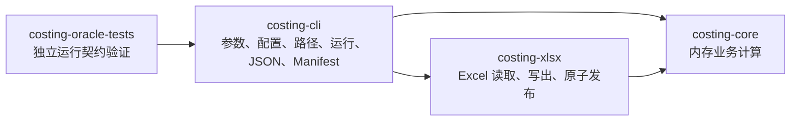

# 当前架构

本项目只有一条正式业务路径：Rust CLI。Python 不参与生产计算，只提供验证工具。

## 四个 crate



依赖只能沿箭头方向。`costing-core` 不知道命令行、文件路径、环境变量或 Excel 格式。

## 稳定接口

应用入口保持：

```text
application::execute(RunRequest) -> RunOutcome
```

职责如下：

1. CLI 解析参数，加载配置并解析输入/输出路径。
2. xlsx 读取器把第一张有效 Sheet 转成 `RawWorkbook`。
3. core 通过一个入口完成全部内存计算：

```text
process_workbook(
  RawWorkbook,
  PipelineRules,
  MonthRange?,
  StageTimings
) -> ProcessedWorkbook
```

4. xlsx writer 根据 cell slots 选择标准或 low-memory 写法，并原子发布。
5. CLI 生成控制台 JSON；显式请求时再生成 `RunManifestV1`。

core 内部顺序固定为：

```text
normalize -> split -> fact -> presentation
```

质量指标和异常分析在 fact / presentation 阶段内完成。CLI 不应知道这些内部步骤，也不得逐个调用它们。

## 性能相关内部表示

- `CellValue::Text` 和 `CellValue::DateLike` 使用 `Arc<str>`；clone cell 时共享文本分配，
  但 reader 不建立全局或按列驻留池。
- xlsx reader 对有限且可安全表示为 `i64` 的整数浮点值直接构造 `Decimal`；
  其他值保留原有字符串格式化和解析回退。
- 这些是 core/xlsx 内部实现，不改变 workbook、CLI、错误码、Sheet 或
  `RunManifestV1` 契约。

取舍与回滚边界见
[`decisions/2026-07-29-cell-value-arc-text.md`](decisions/2026-07-29-cell-value-arc-text.md)。

## 模块边界

### costing-cli

负责：

- CLI 参数和 exit code；
- 默认文件发现、月份后缀和禁止覆盖；
- TOML 配置、schema 校验、配置哈希和字段封闭；
- `RunRequest` / `RunOutcome`；
- 控制台成功/失败 JSON；
- `RunManifestV1`、SHA-256 和路径脱敏。

不负责业务金额计算或 Excel 单元格布局。

### costing-core

负责：

- 表头标准化、别名、向下填充和月份过滤；
- 明细/数量拆分；
- Decimal 金额、单位成本和勾稽；
- 异常池、Modified Z-score、等级和解释；
- 质量指标、error log 和三张 Sheet 的展示模型。

公开面保持小：处理入口、必要模型、配置规则和错误类型。normalize、split、fact、anomaly、presentation 等实现模块只在 crate 内可见。

### costing-xlsx

负责：

- 读取第一个可识别的工作表；
- 标准 writer 和 low-memory writer；
- 样式、列宽、冻结窗格、筛选和条件格式；
- 同目录临时文件、flush/sync、禁止覆盖和原子发布；
- 输出 workbook 的快照与元数据。

两个 writer 是同一适配器内部的实现选择，不向 CLI 暴露第二套业务接口。

### costing-oracle-tests

只验证运行摘要与契约快照，不实现生产业务规则。

## 依赖门禁

架构测试必须保证：

- CLI 可以依赖 core / xlsx；
- xlsx 只能依赖 core 模型，不依赖 CLI；
- core 的 Cargo 依赖不包含 TOML、SHA、Excel 或 CLI 依赖；
- core 源码不读取文件、环境变量或路径配置；
- CLI 不直接引用 core 的内部阶段函数；
- core 内部实现模块不公开。

新增功能时先判断它属于业务计算、Excel 适配还是应用编排，再放入对应 crate。只有出现新的独立部署边界时才考虑新增 crate。
